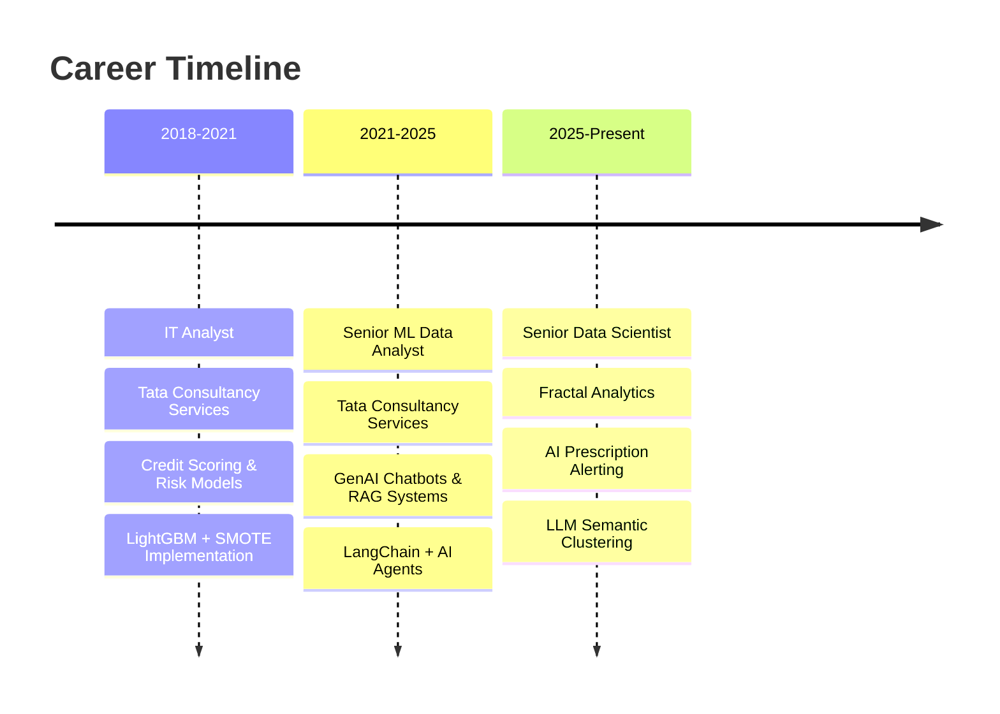

# Hi there, I'm Ankur Shukla! 👋

<div align="center">
  
</div>

<div align="center">
  
[](https://www.linkedin.com/in/ankurshukla1996/)
[](https://github.com/ankur19961)
[](mailto:ankurshukla19961@gmail.com)
[](https://ankur19961-portfolio-app-app-x8yyio.streamlit.app/)

</div>

---

## 🚀 About Me

```python
class AnkurShukla:
    def __init__(self):
        self.name = "Ankur Shukla"
        self.role = "Senior Data Scientist"
        self.location = "Mumbai, India"
        self.experience = "6+ years"
        self.current_company = "Fractal Analytics"
        
    def get_skills(self):
        return {
            "AI/ML": ["LLMs", "RAG", "LangChain", "LangGraph", "PyTorch", "Scikit-Learn"],
            "GenAI": ["Gemini", "OpenAI", "Lamini", "AI Agents", "Fine-tuning"],
            "MLOps": ["Docker", "FastAPI", "AWS", "Model Monitoring", "CI/CD"],
            "Data": ["Python", "SQL", "FAISS", "Pinecone", "ETL", "Big Data"],
            "Viz": ["Tableau", "Power BI", "Streamlit", "Plotly"],
            "Tools": ["Git", "Jupyter", "VS Code", "MLflow", "Airflow"]
        }
    
    def get_current_focus(self):
        return [
            "🤖 Building AI-powered prescription alerting systems",
            "⚡ Optimizing real-time inference pipelines",
            "📊 Implementing semantic search with vector databases",
            "🔍 Reducing AI hallucinations with RAGAS evaluation"
        ]

    def say_hi(self):
        print("Thanks for dropping by! Let's build something amazing together 🚀")

me = AnkurShukla()
me.say_hi()
```

---

## 🛠️ Tech Stack & Tools

<div align="center">

### 🤖 AI & Machine Learning


### ☁️ Cloud & MLOps


### 📊 Data & Analytics


### 🛠️ Development Tools


</div>

---

## 📊 GitHub Analytics

<div align="center">
  
  
</div>

<div align="center">
  
</div>

---

## 🚀 Featured Projects

<div align="center">

[](https://ankur19961-portfolio-app-app-x8yyio.streamlit.app/)

</div>

### 🎯 Project Highlights

<table>
<tr>
<td width="50%">

### 🤖 **AI-Powered Portfolio App**
[](https://ankur19961-portfolio-app-app-x8yyio.streamlit.app/)
[](https://github.com/ankur19961/portfolio_app)

**Revolutionary interactive portfolio featuring AnkBot - an AI assistant that answers professional questions in real-time**

🔧 **Tech Stack:**
- **Frontend**: Streamlit, HTML/CSS, JavaScript
- **AI**: Google Gemini AI, RAG, TF-IDF
- **Backend**: Python, FastAPI
- **Features**: Real-time streaming, Smart filtering, Theme support

📊 **Impact:**
- Sub-300ms response times
- 3x higher engagement vs static portfolios  
- 90%+ accuracy for professional queries
- Smart content filtering & professional focus

**Key Features:**
- 💬 Conversational AI interface
- ⚡ Real-time response streaming
- 🎯 Multi-gate response system
- 🎨 Adaptive dark/light themes
- 📱 Mobile-responsive design

</td>
<td width="50%">

### ⚡ **Real-time Data Pipeline**
[](https://github.com/ankur19961/kafka-streaming-pipeline)

**High-throughput streaming pipeline processing millions of data points daily**

🔧 **Tech Stack:**
- **Streaming**: Apache Kafka, Docker
- **Processing**: Python, Pandas, NumPy
- **Storage**: PostgreSQL, Redis
- **Monitoring**: Grafana, Prometheus

📊 **Performance:**
- 10M+ daily data points processed
- 40% efficiency improvement
- Real-time insights generation
- 99.9% uptime reliability

---

### 🏠 **Redfin Housing Analytics**
[](https://github.com/ankur19961/redfin-housing-pipeline)

**Comprehensive ETL pipeline analyzing 39M housing records with interactive dashboards**

🔧 **Tech Stack:**
- **Cloud**: AWS (S3, Lambda, EC2)
- **Data**: Snowflake, Apache Airflow
- **Visualization**: Tableau, Python
- **Processing**: Pandas, SQL

📊 **Scale:**
- 39M housing records processed
- 10-year price trend analysis
- Interactive Tableau dashboard
- Automated daily updates

</td>
</tr>
</table>

### 💼 **Professional Experience Projects**

- **🚨 AI Prescription Alerting System** - LightGBM + LLM semantic clustering (30% manual intervention reduction)
- **🤖 GenAI Customer Service Bot** - LangChain + RAG automation (80% query automation, 92% accuracy)  
- **💰 Credit Risk Scoring Engine** - ML-based eligibility system (18% default rate reduction)
- **🔍 Semantic Search Pipeline** - OCR + FAISS + Pinecone (31% hallucination reduction)

### 📊 **Additional Analytics Projects**

- **⚡ Real-time Data Pipeline** - Kafka + Docker processing 10M+ daily streaming data points (40% efficiency gain)
- **🏠 Redfin Housing Analytics** - AWS + Snowflake + Airflow ETL pipeline for 39M housing records  
- **💰 Fraud Detection System** - ML models on 7M+ transactions with 15% accuracy improvement
- **🎬 Movie Recommendation Engine** - NLP-based content filtering and user preference matching

---

## 📈 Professional Impact

<div align="center">

| 🎯 Metric | 📊 Achievement |
|-----------|----------------|
| **Manual Interventions Reduced** | 30% |
| **Customer Query Automation** | 80% |
| **Model Precision Improvement** | 38% |
| **Hallucination Reduction** | 31% |
| **Default Rate Reduction** | 18% |
| **Processing Efficiency Gain** | 40% |

</div>

---

## 🌟 Experience Journey



---

## 🏆 Recent Achievements

<div align="center">

🎉 **Built AI prescription system** - Flagging high-risk transactions with 30% efficiency gain  
🚀 **Deployed GenAI chatbot** - Automated 80% of customer queries with 92% accuracy  
⚡ **Optimized real-time alerts** - Sub-300ms latency with FastAPI integration  
📊 **Reduced AI hallucinations** - 31% improvement using RAGAS evaluation framework  

</div>

---

## 🎨 Fun Facts & Interests


- 🤖 Building AI systems that actually solve real problems
- ⚡ Passionate about making AI faster and more reliable  
- 📊 Love turning messy data into actionable insights
- 🔧 Always tinkering with new ML frameworks and tools
- 📚 Continuous learner - currently exploring multimodal AI
- 🎯 Goal: Make AI accessible and beneficial for everyone

---

## 📫 Let's Connect!

<div align="center">

**💬 Open to discussing:**
- AI/ML project collaborations
- GenAI and LLM implementations  
- Data science consulting opportunities
- Open source contributions
- Tech talks and knowledge sharing

**📧 Reach out:** ankurshukla19961@gmail.com

**🌐 Portfolio:** [Interactive AI Portfolio](your-portfolio-link)

</div>

---

<div align="center">

### 🎯 "Turning data into intelligence, one model at a time" 


[](https://github.com/ankur19961)

**⭐ If you find my work interesting, give my repositories a star!**

</div>

---

<div align="center">
  
</div>
